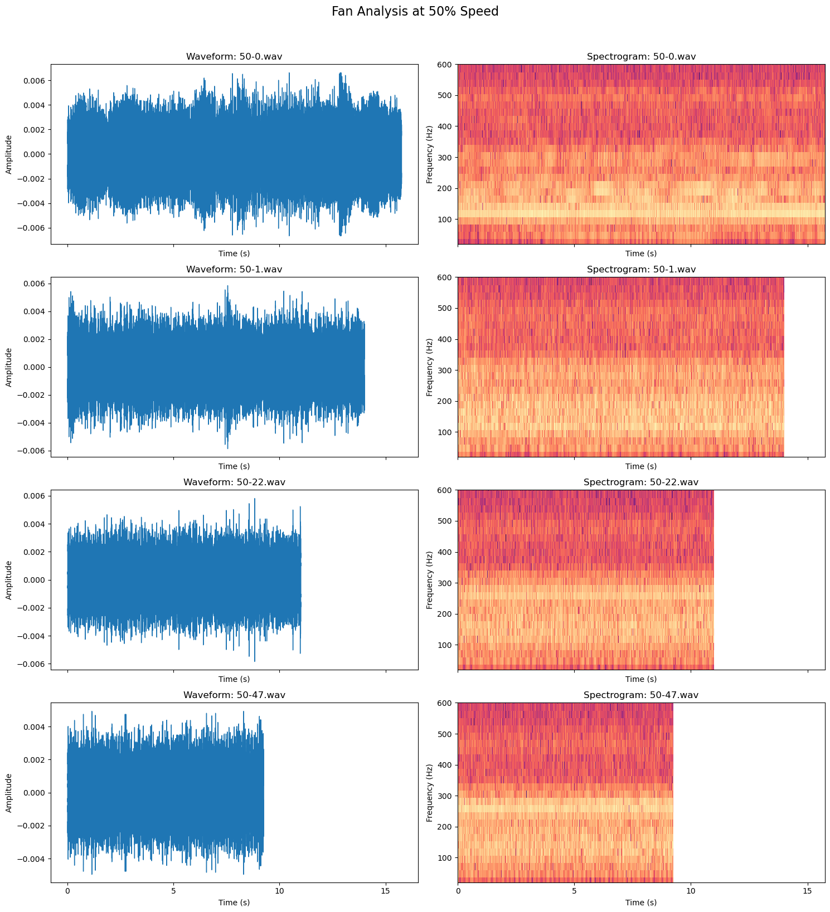
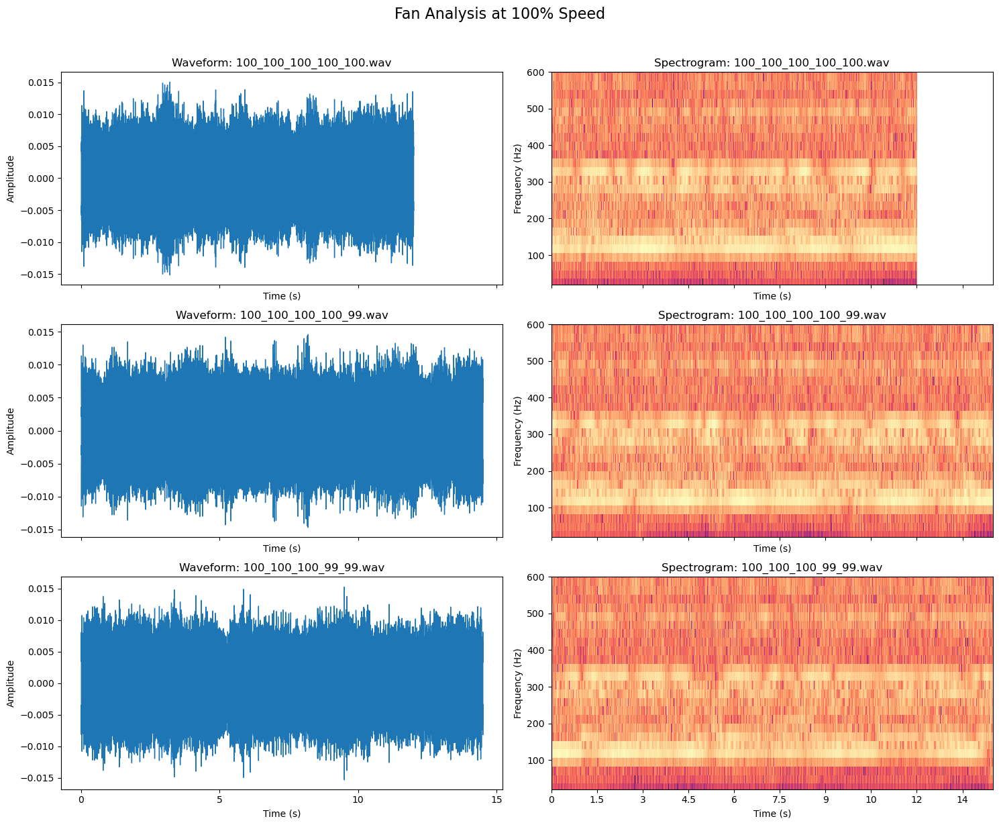
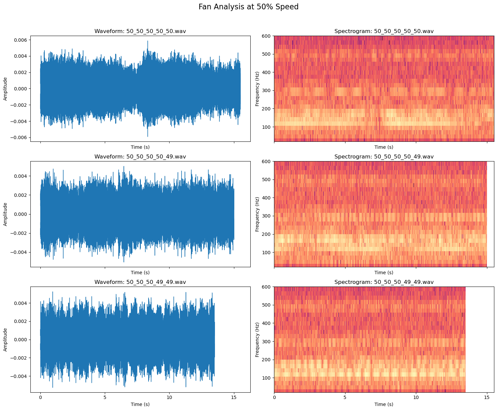
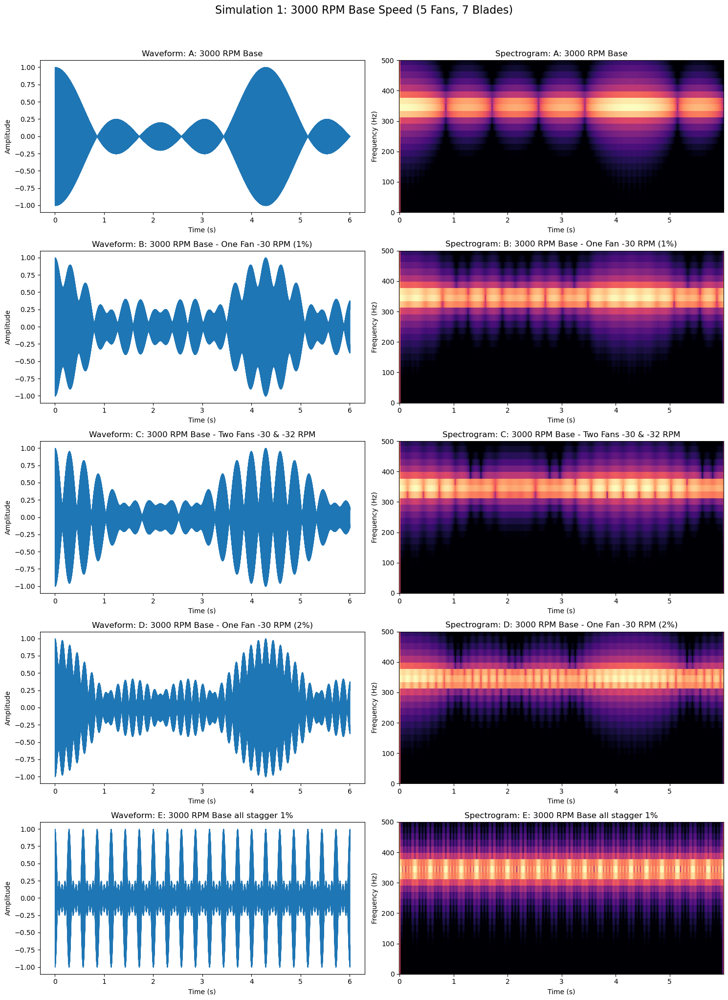
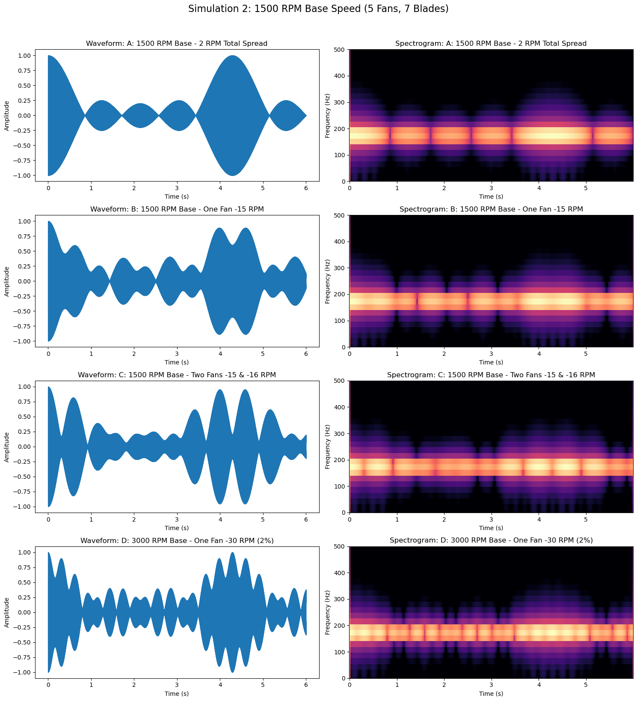

When two fans spin at slightly different speeds, their interaction can cause an undesirable intermittent sound from the fan noise going in and out of phase. Due to manufacturing variations, there is bound to be some speed difference between fans. [Noctua has a great explanation of this phenomenon](https://www.noctua.at/en/expertise/tech/fan-speed-offset-explained). The goal is to push this beat frequency faster so it becomes less perceptible. A slow, oscillating "throb" is annoying, but if the offset is large enough, the beat frequency becomes fast enough to blend harmlessly into the background motor noise.

I wanted to test this phenomenon for a 5-fan setup in preparation for designing my own CR Box style PC fan powered air purifier. Based on my fan research, I am using the 140mm Arctic P14 Pro fans, which have both high static pressures and impressive volumetric flow, while being quite affordable. The max speed is rather loud, so for most of its operation I intend to run them at 50% speed unless my air quality monitor detects pollution. 

Test Setup: 5 fans side by side connected to my prototype ESP32 fan controller. The 5 PWM Fan headers can be driven independently. Unfortunately I haven’t finished my CR Box design so this is not an in vivo test.

## Stepped Difference

The first test involves running the 5 fans at a consistent speed difference. 

| Scenario | Five Fan Speeds (%) | Playback |
| :--- | :--- | :--- |
| **100% Base** | `100, 100, 100, 100, 100` | <audio controls preload="none" style={{width: '100%', minWidth: '200px'}}><source src="/fan_audio/100-0.mp3" type="audio/mp3" /></audio> |
| **100% (Δ1.0)** | `100, 99, 98, 97, 96` | <audio controls preload="none" style={{width: '100%', minWidth: '200px'}}><source src="/fan_audio/100-1.mp3" type="audio/mp3" /></audio> |
| **100% (Δ2.2)** | `100, 97.8, 95.6, 93.4, 91.2` | <audio controls preload="none" style={{width: '100%', minWidth: '200px'}}><source src="/fan_audio/100-22.mp3" type="audio/mp3" /></audio> |
| **100% (Δ4.7)** | `100, 95.3, 90.6, 85.9, 81.2` | <audio controls preload="none" style={{width: '100%', minWidth: '200px'}}><source src="/fan_audio/100-47.mp3" type="audio/mp3" /></audio> |
| **50% Base** | `50, 50, 50, 50, 50` | <audio controls preload="none" style={{width: '100%', minWidth: '200px'}}><source src="/fan_audio/50-0.mp3" type="audio/mp3" /></audio> |
| **50% (Δ1.0)** | `50, 49, 48, 47, 46` | <audio controls preload="none" style={{width: '100%', minWidth: '200px'}}><source src="/fan_audio/50-1.mp3" type="audio/mp3" /></audio> |
| **50% (Δ2.2)** | `50.0, 47.8, 45.6, 43.4, 41.2` | <audio controls preload="none" style={{width: '100%', minWidth: '200px'}}><source src="/fan_audio/50-22.mp3" type="audio/mp3" /></audio> |
| **50% (Δ4.7)** | `50.0, 45.3, 40.6, 35.9, 31.2` | <audio controls preload="none" style={{width: '100%', minWidth: '200px'}}><source src="/fan_audio/50-47.mp3" type="audio/mp3" /></audio> |

The beat frequency is slightly audible if I listen for it. On the audio waveform, there is a clear amplitude variation that improves with as little as 1% offset. On the spectrogram, the beat's pitch appears to be at around 150 and 300 Hz. 

## Single/Dual Fan Difference

The next test involves running one or two fans at a slower speed.

| Scenario | Five Fan Speeds (%) | Playback |
| :--- | :--- | :--- |
| **100% Base** | `100, 100, 100, 100, 100` | <audio controls preload="none" style={{width: '100%', minWidth: '200px'}}><source src="/fan_audio/100_100_100_100_100.mp3" type="audio/mp3" /></audio> |
| **100% (1 Fan ↓)** | `100, 100, 100, 100, 99` | <audio controls preload="none" style={{width: '100%', minWidth: '200px'}}><source src="/fan_audio/100_100_100_100_99.mp3" type="audio/mp3" /></audio> |
| **100% (2 Fans ↓)** | `100, 100, 100, 99, 99` | <audio controls preload="none" style={{width: '100%', minWidth: '200px'}}><source src="/fan_audio/100_100_100_99_99.mp3" type="audio/mp3" /></audio> |
| **50% Base** | `50, 50, 50, 50, 50` | <audio controls preload="none" style={{width: '100%', minWidth: '200px'}}><source src="/fan_audio/50_50_50_50_50.mp3" type="audio/mp3" /></audio> |
| **50% (1 Fan ↓)** | `50, 50, 50, 50, 49` | <audio controls preload="none" style={{width: '100%', minWidth: '200px'}}><source src="/fan_audio/50_50_50_50_49.mp3" type="audio/mp3" /></audio> |
| **50% (2 Fans ↓)** | `50, 50, 50, 49, 49` | <audio controls preload="none" style={{width: '100%', minWidth: '200px'}}><source src="/fan_audio/50_50_50_49_49.mp3" type="audio/mp3" /></audio> |

The one fan slow down is an improvement over running everything at the same speed. The two fan slow down is not an obvious improvement. 

## Simulations 

I generated these audio files by summing sine waves in Python. The 7 blade fan was simulated at 3000 RPM and 1500 RPM with a ±2 RPM variance. One and two fans were simulated at 1% slower. One fan was simulated at 2% slower. 

| Scenario | Offset Strategy | Playback |
| :--- | :--- | :--- |
| **Test A** | **Base Cluster** (±2 RPM variance) | <audio controls preload="none" style={{width: '100%', minWidth: '200px'}}><source src="/fan_audio/sim_3000_a.mp3" type="audio/mp3" /></audio> |
| **Test B** | **1 Fan Drop** (-1% / -30 RPM) | <audio controls preload="none" style={{width: '100%', minWidth: '200px'}}><source src="/fan_audio/sim_3000_b.mp3" type="audio/mp3" /></audio> |
| **Test C** | **2 Fan Drop** (-1% / -30 RPM) | <audio controls preload="none" style={{width: '100%', minWidth: '200px'}}><source src="/fan_audio/sim_3000_c.mp3" type="audio/mp3" /></audio> |
| **Test D** | **1 Fan Drop** (-2% / -60 RPM) | <audio controls preload="none" style={{width: '100%', minWidth: '200px'}}><source src="/fan_audio/sim_3000_d.mp3" type="audio/mp3" /></audio> |
| **Test E** | **Linear Stagger** (Steps of 1%) | <audio controls preload="none" style={{width: '100%', minWidth: '200px'}}><source src="/fan_audio/sim_3000_e.mp3" type="audio/mp3" /></audio> |

| Scenario | Offset Strategy | Playback |
| :--- | :--- | :--- |
| **Test A** | **Base Cluster** (±2 RPM variance) | <audio controls preload="none" style={{width: '100%', minWidth: '200px'}}><source src="/fan_audio/sim_1500_a.mp3" type="audio/mp3" /></audio> |
| **Test B** | **1 Fan Drop** (-1% / -15 RPM) | <audio controls preload="none" style={{width: '100%', minWidth: '200px'}}><source src="/fan_audio/sim_1500_b.mp3" type="audio/mp3" /></audio> |
| **Test C** | **2 Fan Drop** (-1% / -15 RPM) | <audio controls preload="none" style={{width: '100%', minWidth: '200px'}}><source src="/fan_audio/sim_1500_c.mp3" type="audio/mp3" /></audio> |
| **Test D** | **1 Fan Drop** (-2% / -30 RPM) | <audio controls preload="none" style={{width: '100%', minWidth: '200px'}}><source src="/fan_audio/sim_1500_d.mp3" type="audio/mp3" /></audio> |

## Conclusions
With these tests and simulations, we can see that running just 1 fan at 1-2% slower than the rest increases the beat frequency. This higher frequency beat is much less perceptible than the slow, throbbing drone produced when all the fans are commanded to run at the same speed. Increasing the stagger or increasing the slow fan count does not improve the beat frequency issue, yet it decreases performance by spinning many of the fans slower. With my final design, I will have 1 fan PWM header controlled separately to run one fan at 2% slower than the rest.