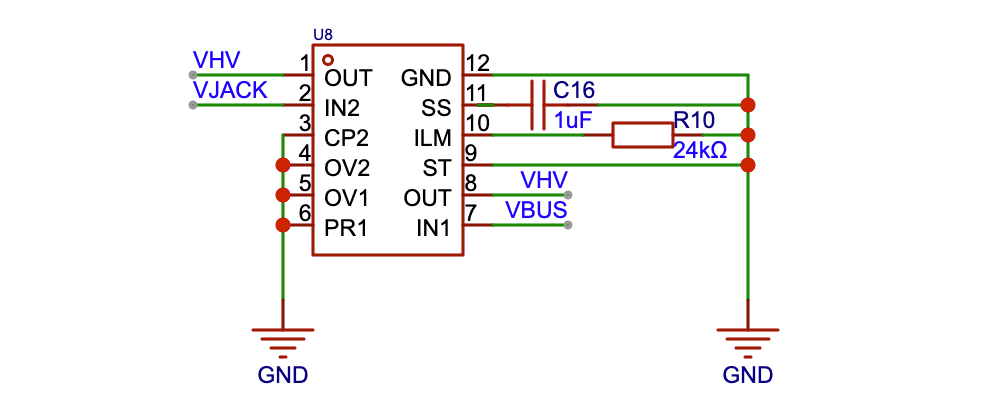
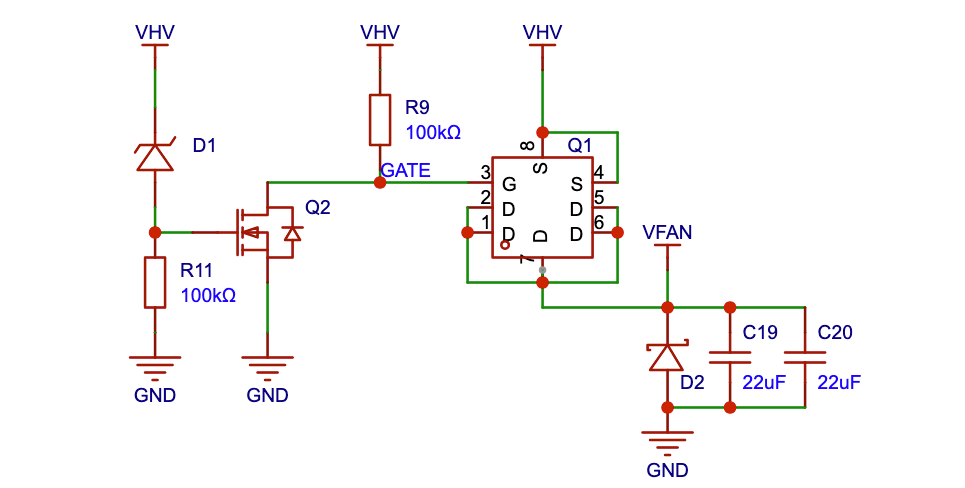
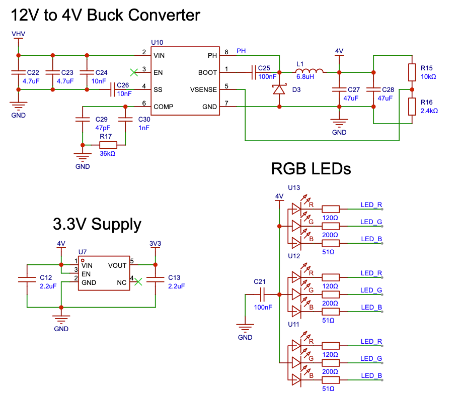

A technical overview of the circuit board design, highlighting the specific engineering trade-offs and design logic used to bring the hardware to life.

## Fan Controller Power Management

### Power OR-ing 

The board accepts power from two sources: a USB-C port and a 12V DC barrel jack. The USB input voltage varies (5V/9V/12V) based on PD negotiation, while the barrel jack is a fixed 12V.

I needed to prevent the 12V jack from back-feeding into the USB port, which would destroy the USB source. Standard diodes can prevent this, but they create a voltage drop that generates significant heat at higher currents.

To solve this, I used the TPS2121 (`U4`). This chip functions as an "ideal diode" controller. It monitors both inputs `VBUS` and `VJACK` and automatically gates the higher voltage through to the main rail `VHV`. This protects the input ports and eliminates the heat issue associated with standard diodes.

### Fan Rail Switch & Logic

Standard 5V computer USB ports cannot supply enough current to power multiple 12V fans. I designed this circuit to ensure the fan rail `VFAN` remains OFF unless the board is receiving at least 9V (via USB-PD or the barrel jack).

The logic chain relies on detecting the voltage of the main rail `VHV`:

1. Voltage Sensing `D1`: I used a Zener diode `D1` with a 5.6V breakdown voltage. If the board is plugged into a standard 5V USB port, D1 blocks current, keeping the entire circuit off.

2. Logic Switch `Q2`: When the supply exceeds 5.6V, `D1` conducts and activates `Q2` (N-MOSFET). `Q2` pulls the gate of the main switch to ground.

3. High-Side Switch `Q1`: The fans are controlled by `Q1`, a P-MOSFET. Since P-MOSFETs activate when their gate is pulled low, the signal from `Q2` turns `Q1` on, powering the fans.

Inductive Load Protection `D2`: I added a flyback diode (`D2`) across the fan output. Since fans are inductive loads, they generate a negative voltage spike when power is cut. `D2` shunts this current, protecting the MOSFETs from damage.

### Current Capacity & Protection

All components were selected to handle 4A continuous current, which is required to drive ten Arctic P14 Pro fans at full speed alongside the ESP32 and LEDs. I calculated the PCB trace widths to support this thermal load and integrated self-resetting (PTC) fuses for overcurrent protection.

### Buck Converters & LDO for the LEDs & ESP32

The ESP32 microcontroller runs on 3.3V. While a standard linear regulator (LDO) is simple, it works by burning off excess voltage as heat. This is fine for small drops like 5V USB line to 3.3V, but extremely inefficient when stepping down from 12V fan power line to 3.3V. Instead, I used a buck converter to efficiently convert the voltage with minimal energy loss.

I tuned this converter to output 4V because the RGB status LEDs can require up to 3.6V due to manufacturing variance. On a standard 3.3V rail, some LEDs would light up while others would be too dim.

I used a small secondary LDO to step the 4V down to 3.3V for the ESP32, while the LEDs run directly off the 4V rail. To control them, I wired the ESP32 to the negative side of the LEDs. When the chip outputs 3.3V, the small voltage difference keeps the LED off. When the pin switches to Ground, the full 4V flows through, turning the light on.