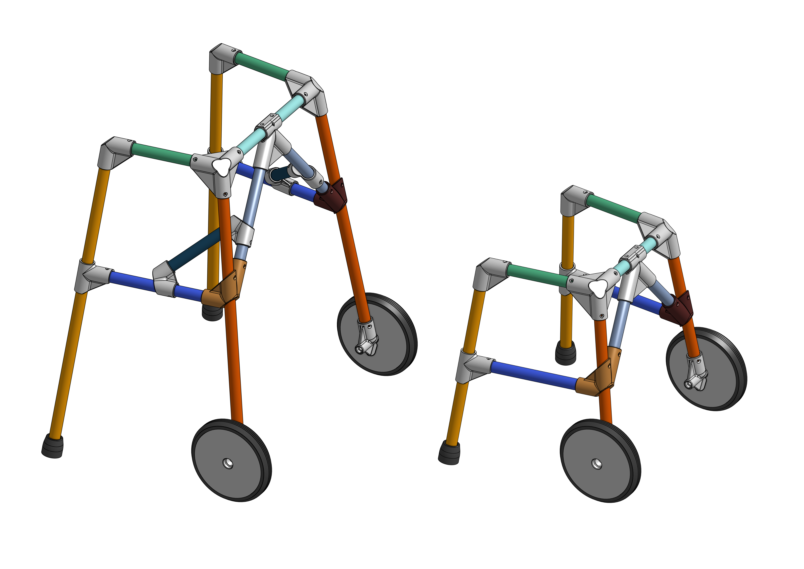
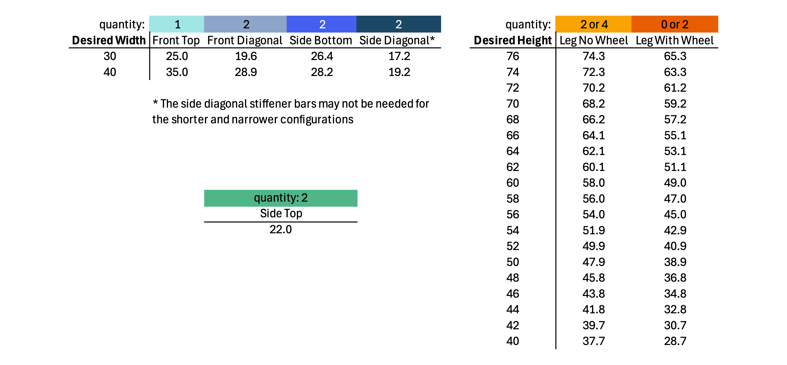
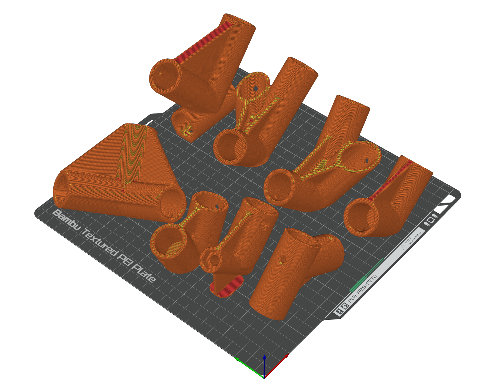

## Introduction

This project introduces a 3D-printable pediatric walker designed for use in resource-limited settings. The [3D model is available to view on Onshape](https://cad.onshape.com/documents/8d69d3a2bb84475a7d4f6d9b/w/00c9b4cc4adb487794773c82/e/b39ecb02c38161144f479e0a).

For 30 years, our medical team has provided pediatric orthopedic corrections in remote regions globally, including Kurdistan, the Philippines, China, Madagascar, and others. A critical and constant need is for appropriately sized pediatric walkers. Currently, we either bring in pediatric walkers, consuming precious luggage space needed for other medical supplies, or modify adult-sized walkers by cutting down the legs.

Modifying adult walkers is functionally inadequate. The width between handgrips cannot be adjusted, forcing children into an inefficient and difficult posture with arms outstretched. The smallest patients often cannot use these adapted walkers at all.

This project's goal is to design a pediatric walker that can be manufactured locally and affordably using 3D-printed joints and readily available wooden dowels (e.g., broomsticks). An optional wheeled version is included for patients who would benefit from a rollator.

This project was built upon the work of [Anita So et al. at Western University](https://doi.org/10.3390/inventions8030079). Their research and shared designs were instrumental to this project's development.

## Design & Manufacturing Considerations

This design builds on the Western University model and is optimized for strength, ease of assembly, and manufacturing in challenging environments.

### Structural Integrity

Analysis by the Western University team identified the top front corner piece as the weakest point under horizontal loads, with Z-axis layer separation contributing to failure. In Fused Filament Fabrication, prints are generally considered to be weakest along the Z-axis (the bond between layers) and strongest in the XY-plane (a continuous extrusion).

This design hypothesizes that converting critical forces into hoop stress handled by the strong XY-plane will create a more robust part. Every joint incorporates a "hoop" feature that wraps around the dowel sockets as a continuous loop of plastic in the XY-plane. This design intentionally avoids relying on the weaker Z-axis layer adhesion to bear the primary load, instead using the inherent tensile strength of the extruded filament itself.

### Ease of Assembly & Post-Processing

**Reduced Part Count & Intuitive Assembly:** Universal parts are used where possible, eliminating separate left- and right-sided components. Parts are designed to be either fully symmetrical or obviously asymmetrical to prevent incorrect assembly.

**Simplified Fastening:** Screw count is minimized, as their primary function is dowel retention, not structural strength.

**Minimal Post-Processing:** All components are designed to print without support structures or brims. Horizontal holes have a teardrop shape to compensate for filament sag, ensuring easy insertion of rods and screws without drilling or deburring.

### Local Manufacturing Feasibility
**Parametric Dowel Diameter:** The CAD model uses a single variable for dowel diameter, allowing all parts to be automatically updated to fit locally sourced materials.

**Small-Format Printer Compatibility:** In many of the regions served, power outages are a frequent challenge. This design is optimized for small-format printers (e.g., Prusa MINI, Bambu Lab A1 Mini) that use DC-powered beds. Their lower power draw is compatible with smaller, affordable battery backup (UPS) systems, making local manufacturing more feasible than with larger, AC-powered printers. This constrains max part size to 180x180 mm.

**Compliant Sockets:** A groove is integrated into dowel sockets to allow slight flex for easier insertion. This feature is placed along a reinforcing rib to maintain strength.

### Functional Additions
**Large wheels:** Optional wheels are designed to be as large as the build volume allows, improving performance on the uneven terrain common in target locations.

**Assembly Toolkit:** To aid in on-site assembly, the project includes a 3D-printable toolkit. This includes a printed screwdriver with a socket for tightening bolts, a print-in-place toolbox to hold essential tools, and a cutting jig with a screw hole to guide a straight cut for the dowels.

## Printing and Assembly instructions

Matierals Needed:
* [Wooden Dowels](https://www.homedepot.com/p/Waddell-Hardwood-Round-Dowel-36-in-x-0-875-in-Sanded-and-Ready-for-Finishing-Versatile-Wooden-Rod-for-DIY-Home-Projects-6314U/100556152)
* [PETG Printer Filament](https://us.elegoo.com/products/rapid-petg-filament-1-75mm-10kg?variant=45291216502965)
* [85A TPU Printer Filament](https://siraya.tech/products/flex-tpu-85a-filament)
* [#6 x &frac12; Flat Head Wood Screws](https://boltdepot.com/Product-Details?product=3953)
* [90 mm M8 Bolts](https://boltdepot.com/Product-Details?product=6233)
* [M8 Nylon Lock Nuts](https://boltdepot.com/Product-Details?product=4806)
* [608 Bearings](https://a.co/d/35gzUZA)

First, decide on the wooden dowel. In the US I used &frac78; inch wooden dowels from the hardware store. In Kurdistan I used whatever broomstick I could find that felt sturdy and have consistent diameter. Measure the diameter of multiple dowels, rotating them as they are not perfect circles. Take the max or close to max diameter and enter it as the `Rod_Diameter` variable on OnShape's Variable Table. The drawings automatically add 0.5 for the socket size to ensure fit, adjust if needed. 

Export all the parts for printing, then slice and print following the slcicing and prining recommendations at the end of this article. Quantity in the table below. Dependent on wheeled vs. non wheeled configuration. The smaller walker configuration may not need the stiffener. 

| Part | Quantity |
| :--- | :--- | 
| Top Front | 2 | 
|Top Back | 2 | 
|Bottom Back | 2 |
|Bottom Front L | 1 |
|Bottom Front R | 1 |
|Top Middle | 1 |
|Stiffener | 4 or 0|
|Wheel | 0 or 2| 
|Wheel Connector | 0 or 2|
|Wheel Tread | 0 or 2 |
|Rubber Foot | 2 or 4| 

Next, cut the wooden dowel to length to achieve the desired hand grip width and height to fit the patient. The table coloring matches the 3D rendering for easy identification. [Download the dowel length table (PDF).](/walker-dowel-cut-length.pdf) The printable cutting jig makes it easier to cut straight.

With the parts printed and dowel cut, assemble the walker, starting with the pieces in the front then build to the back. Here is the video of the assembly process:

<YouTube id="r4OTfujNRjI?si" />

### Slicing and Printing Recommendations 
The following settings are a distillation of tests by others in the 3D printing community and have served as a reliable rule of thumb in this project. They are a recommended starting point. 

PETG and especially TPU benefit from drying, and I have designed and built a drybox system with a dehydrator, available on printables and makerworld. 

#### PLA 
The cutting jig and the tool box were printed in PLA with 0.4mm nozzle, pretty much at the default slicer setting. I did place a modifier block of 100% infill on the cutting jig where the saw passes through to extend the jig's service life. 

#### High Flow or Regular PETG
I currently use the transparent Elegoo Rapid PETG to print every part except for the rubber foot and treads. The auto orientation function works pretty well to put the part in the correct rotation for priting. 

| Setting | Value | Rationale |
| :--- | :--- | :--- |
| Nozzle Size | 0.8mm | Faster, stronger prints. |
| Printing Temperature | 250°C | Adjust as needed. Hotter melts more and likely gives better interlayer bonding. |
| Layer Height | 0.4mm | A good balance for a 0.8mm nozzle. Higher layer heights are faster, but the nozzle is further from the previous layer, transferring less heat to remelt and bond with it. |
| Extrusion Width | Inner Wall: 1.2mm, Others: Default (0.82) | Over-extruding the inner walls (150% of nozzle diameter) is theorized to force more molten plastic into the part, increasing pressure and improving the thermal bond between layers. |
| Wall Loops | 3 | Creates a thick, strong shell. The total wall thickness (0.9mm outer + 1.2mm inner + 1.2mm inner = 3.3mm) is similar to using ~4 loops at a default width, but the over-extruded inner walls create a better bond. Features &lt;6.6mm become solid. |
| Wall Generator | Arachne | A classic wall generator uses a fixed width and may fill small gaps with short, disconnected extrusions. Arachne uses a variable width to maintain a continuous toolpath, which appears structurally superior for the hoop-based design of these parts. |
| Infill Density | 60% | Since the primary failure mode is layer separation at the walls, a very high infill is less critical than strong perimeters. 60% is likely excessive. For the wheel, 15% infill was used, as it is a large part with thick walls and short lever arms unlike the walker joint which has large lever arm causing very localized and more extreme stress. |
| Infill Pattern | Gyroid | Strong in all axes, and deforms before catastrophic failure. This is preferable to the abrupt, brittle failure of a pattern like Cubic, which may be similarly strong and print faster. |
| Volumetric Speed | 8-15 mm³/s | This is the true bottleneck on print speed. Pushing this limit results in under-extrusion, improper melting, and weak parts. These values are conservative to prioritize strength. |
| Seam Position | Random | Distributes the Z-seam (a potential weak point where a layer starts and stops) across the part. Functional not cosmetic. |

#### 85A TPU
I currently use Siraya Tech Flex TPU - 85A Black to print the tread and rubber foot. I tested some 95A TPU but the are not as grippy. 

| Setting | Value | Rationale |
| :--- | :--- | :--- |
| Nozzle Size | 0.8mm | The back pressure for soft TPU is lower with a wider nozzle. |
| Printing Temperature | 210°C | As recommended by the manufacturer. |
| Layer Height | 0.4mm | Default layer height for 0.8mm nozzles. |
| Extrusion Width | Default (0.82mm) | TPU does not do well with over-extrusion, so revert to the default setting unlike the PETG setting above. |
| Wall Loops | 4 | More loops to maintain wall thickness with the thinner extrusion width. The wheel tread will be printed horizontally so wall loops equals tread thickness. |
| Bottom shell thickness | 1 mm | The rubber foot will be printed standing up, having a thicker wear layer should increase durability. |
| Infill Density | 15% | Default infill density. Since the strength and wear resistance is from the wall loops and top/bottom shell thickness, this setting should not matter as much. |
| Infill Pattern | Gyroid | Strong in all axes. |
| Volumetric Speed | 4-5 mm³/s | TPU prints are slow, higher rates cause uneven extrusion because of the back pressure built up. |
| Seam Position | Nearest | TPU is prone to stringing, and the “Nearest” setting minimizes travel to reduce stringing. |
| Print Sequence | By Object | TPU is prone to stringing, by printing one part after the other instead of printing both by layer, travel between parts reduced to once only, preventing stringing between the 2 parts. This setting severely limits the amount of object that can be printed on the bed at once. |
